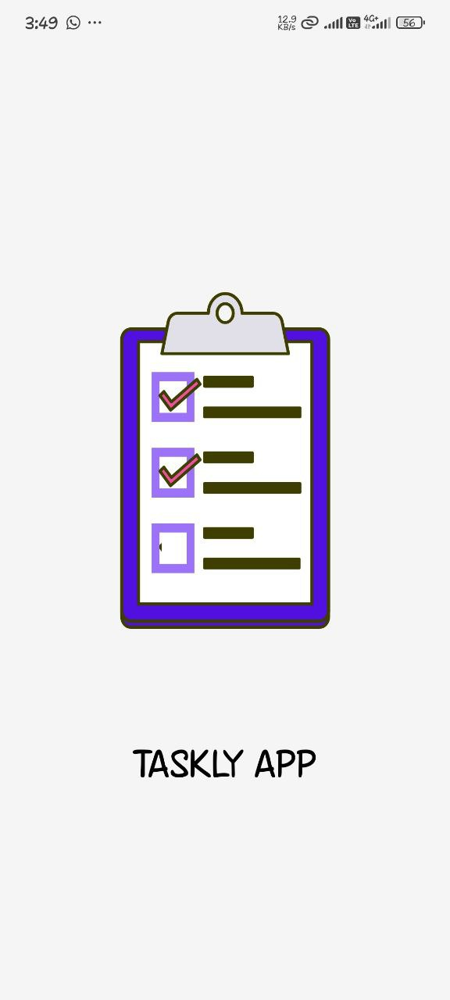
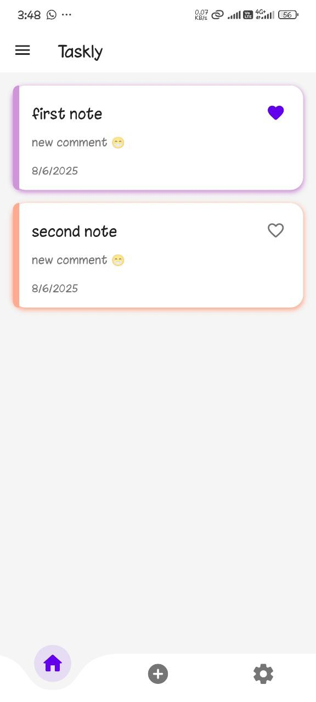
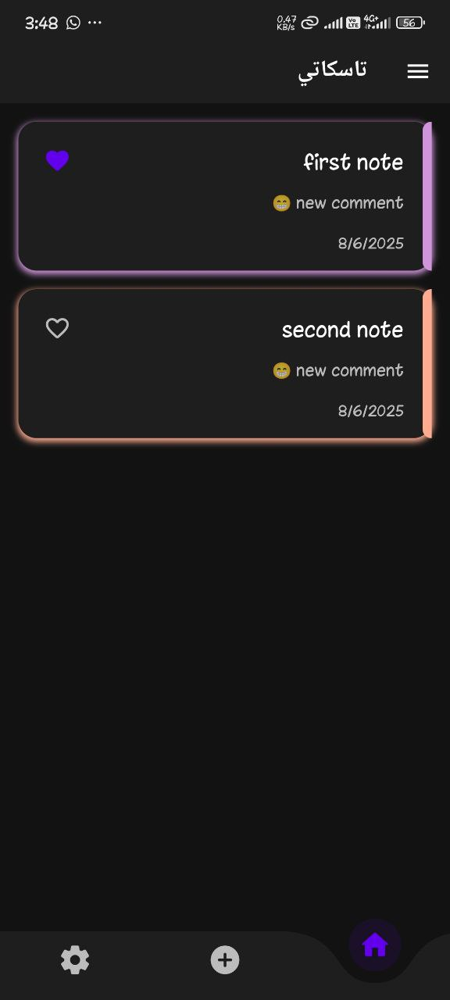
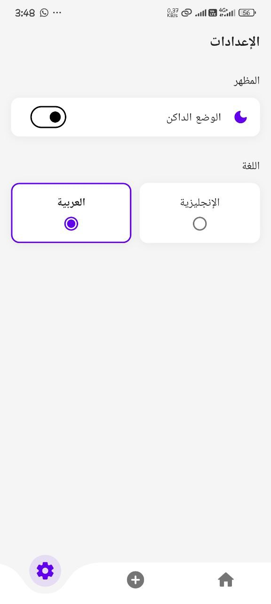
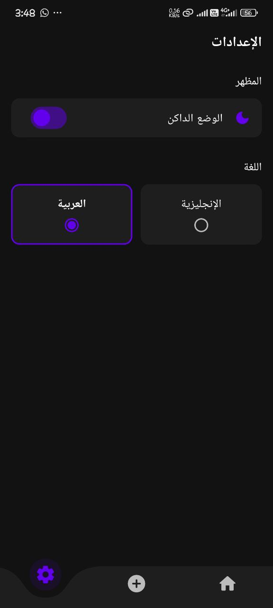
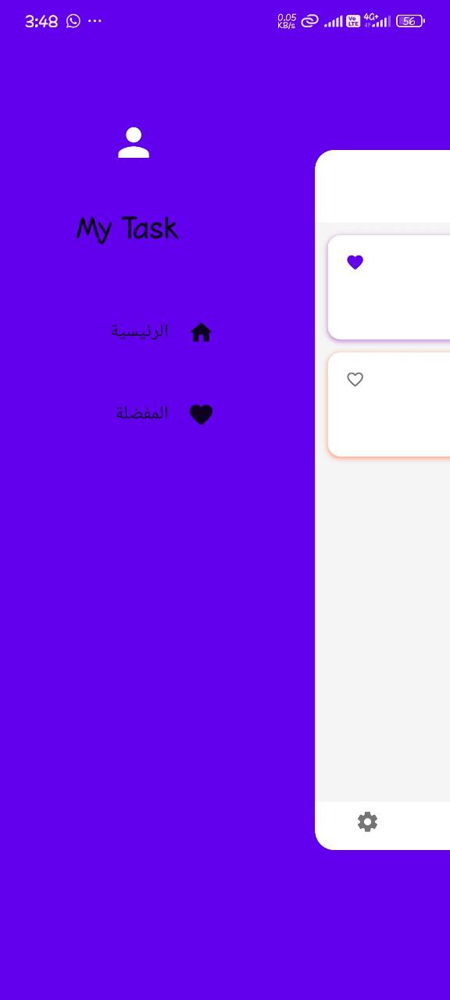
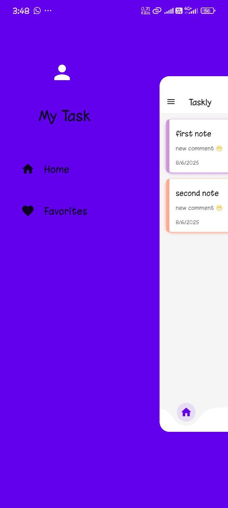
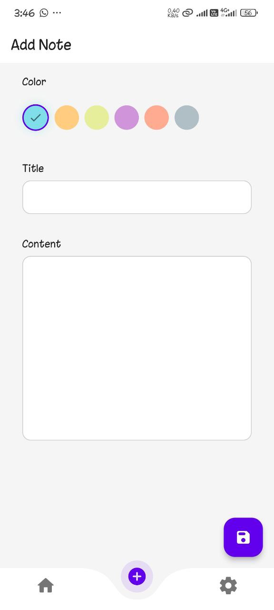
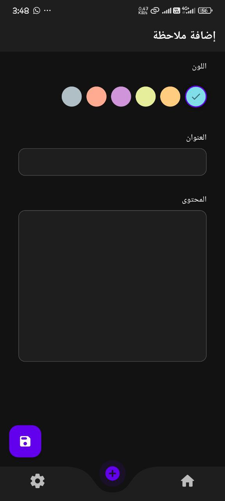
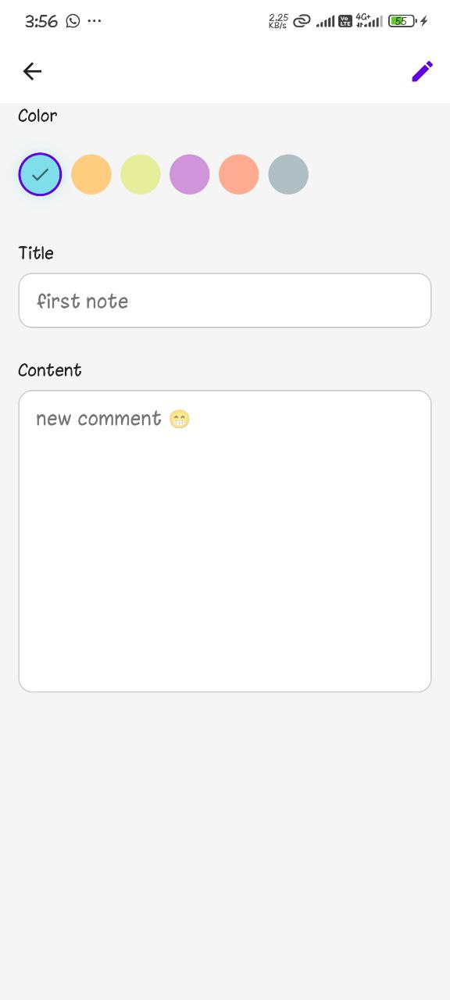

# 📋 Taskly App

**Taskly** is a modern, minimalist task management app built with **Flutter**. It offers an intuitive interface with support for **dark/light mode**, **Arabic and English languages**, favorite tasks, and interactive task cards with timestamps and comments.

---

## 📑 Table of Contents

- [Features](#-features)
- [Screenshots](#-screenshots)
- [Installation](#-installation)
- [Usage](#-usage)
- [Technologies Used](#-technologies)
- [Demo Video](#-demo-video)
- [Upcoming Features](#-upcoming-features)
- [Contributing](#-contributing)
- [License](#-license)
- [Developer](#-developer)

---

## ✅ Features

- 🌓 **Dark & Light Mode** - Smooth toggle between light and dark themes.
- 🌐 **Multilingual Support** - Switch between Arabic 🇸🇦 and English 🇺🇸.
- 🗂️ **Task Management** - Add, view, and organize tasks with timestamps and comments.
- ❤️ **Favorites System** - Mark important tasks for quick access.
- 🧭 **Side Navigation Drawer** - Navigate easily through app sections.
- 🎨 **Clean & Responsive UI** - Designed for a seamless mobile experience.

---

## 📸 Screenshots

| Splash           | Home (Light)     | Home (Dark)      | Settings (Light) | Settings (Dark) |
|-------------------|------------------|------------------|------------------|-----------------|
|  |  |  |  |  |

| Menu (English)   | Menu (Arabic)    | Add Task (Light) | Add Task (Dark)  | Edit Task       | Favorite Task   |
|-------------------|------------------|------------------|------------------|-----------------|-----------------|
|  |  |  |  |  |  |

---

## 🚀 Installation

Follow these steps to run the app locally:

```bash
# 1. Clone the repository
git clone https://github.com/your-username/taskly_app.git
cd taskly_app

# 2. Install dependencies
flutter pub get

# 3. Run the app
flutter run
```

✅ Ensure Flutter is installed on your device: [Flutter Setup Guide](https://flutter.dev/docs/get-started/install)

---

## 🎯 Usage

- ➕ Use the **Add** button to create a new task.
- ❤️ Tap the **heart icon** to mark a task as a favorite.
- ⚙️ Switch the **theme and language** from the settings screen.
- 📂 Use the **side drawer menu** to navigate to **Home** and **Favorites** sections.

---

## 🛠️ Technologies Used<a id="technologies"></a>

| Technology           | Purpose              |
|-----------------------|----------------------|
| Flutter              | UI Framework         |
| Dart                 | Programming Language |
| SharedPreferences/sqflite | Local Storage        |
| BLoC/Cubit (if used) | State Management     |
| Flutter Localization | Language Switching   |

---

## 🎥 Demo Video <a id="demo"></a>

Watch the demo video to see Taskly in action:

(https://www.linkedin.com/posts/hamed-ahmed-1b56921a1_excited-to-introduce-taskly-my-new-flutter-activity-7292616678029381632-7w_g?utm_source=share&utm_medium=member_desktop&rcm=ACoAAC9Dv5kBRnIYDAd4LYXYG0VOkzb8039r7t4)
---

## 🧪 Upcoming Features

- 🔔 Push Notifications for reminders
- 📅 Task Due Dates and Calendar View
- 🔄 Cloud Sync (Firebase or Supabase)
- 🧩 Subtasks and Categories
- 📤 Share Tasks with Others

---

## 🤝 Contributing

Contributions are welcome! To improve this app or report bugs:

1. **Fork the repo**
2. **Create a branch**

   ```bash
   git checkout -b new-feature
   ```

3. **Commit your changes**

   ```bash
   git commit -m "Add feature"
   ```

4. **Push to GitHub**

   ```bash
   git push origin new-feature
   ```

5. **Open a Pull Request**

---

## 📄 License

This project is licensed under the **MIT License**. See the [LICENSE](LICENSE) file for more information.

---

## 👨‍💻 Developer

**Developed by:** Hamed Ahmed  
📧 Email: [hamedahmed143022@gmail.com](mailto:hamedahmed143022@gmail.com)  
📱 App Name: **Taskly**
```